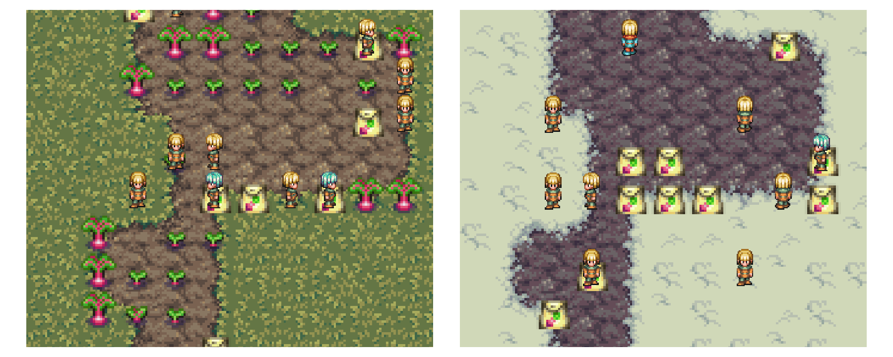

# Territories

An environment for kinship-aligned multi-agent reinforcement learning — where agents with diverging interests either learn to cooperate or see their lineage go extinct.

The best place to understand why _Territories_ and follow the experimental results is the through the blog series: **Emerging a Society with MARL**.

The best place to understand RL environments written in C is by studying [PufferLib](https://puffer.ai/docs.html).

## Install

Install raylib.h and the requirements.txt. Compile the environment using `sh build.sh`.

The you can use the environment in Python. See `src/territories.py` for an example.
